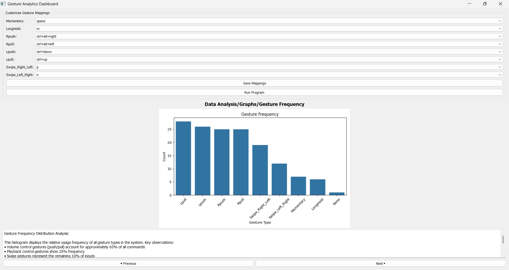
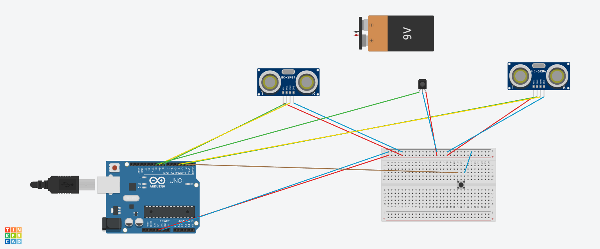

# PalmPilot

PalmPilot is a hand-gesture based video playback system. Arduino sensors detect your hand gestures and the appropriate actions such as forward, rewind, volume-up etc are triggered. All actions are customizable.

## Gestures

- **Momentary Hold:** Quickly put your hand in front of the Infrared sensor.
- **Long Hold:** Place your hand in front of the Infrared sensor and hold it there.
- **Push:** Push your hand towards the Ultrasonic sensor (left and right sensors have different actions)
- **Pull:** Pull your hand away from the Ultrasonic sensor (left and right sensors have different actions)
- **Swipe:** Swipe left or right

## Demo






## Prerequisites

- Arduino IDE
- Python 3.7+
- Installed python packages: pyserial

## Instructions

1. **Clone the repository**:

   ```bash
   git clone https://github.com/omkarh20/PlayScout.git
   cd PlayScout
   ```

2. **Setup**:

- Make the connections as shown in the above images. If different pins are used, change the numbers in Gesture_Video_Control.ino.
- Open Gesture_Video_Control.ino in Arduino IDE and select the Arduino Uno board and port.
- Make sure that the same port number is mentioned in control.py

3. **Execution**:

- Execute `python3 PalmPilot.py`
- Change any mappings if needed and press "Save mappings".
- Press "Run Program"
- Press the button placed on the breadboard
- Open any video playback app and make gestures. The appropriate actions will be done

**Note:** By default, all the gesture-actions mappings are for VLC Media Player. Change if needed