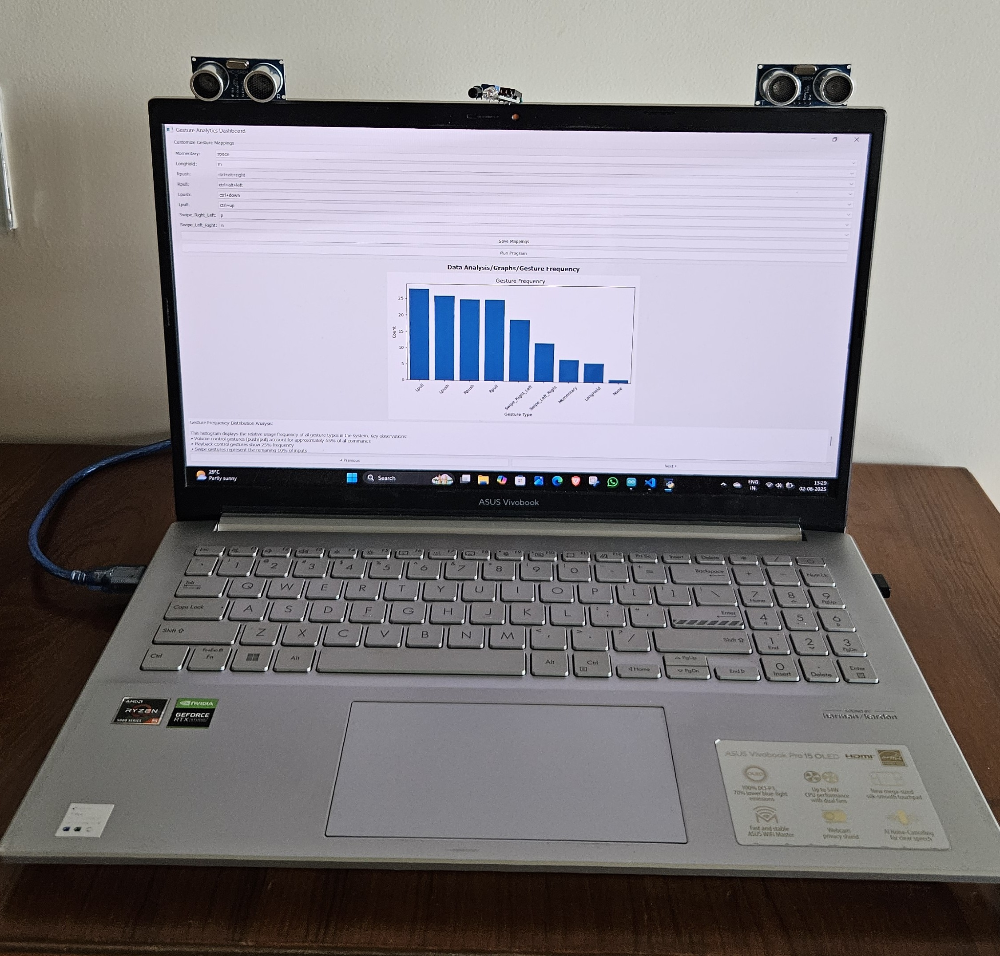
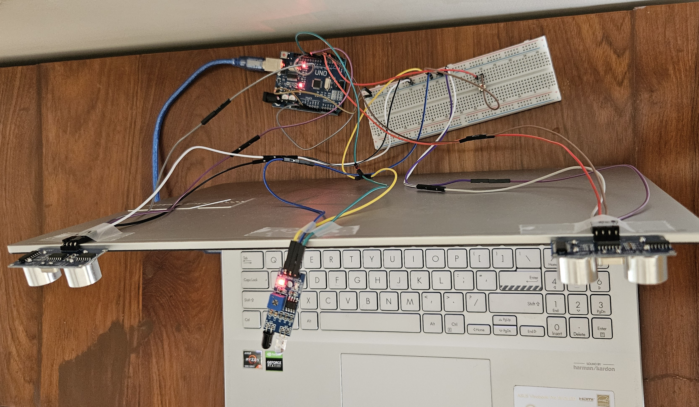

# PalmPilot

PalmPilot is a hand-gesture based video playback system. Arduino sensors detect your hand gestures and the appropriate actions such as forward, rewind, volume-up etc are triggered. Actions are detected by two ultrasonic sensors and one infrared sensor. A push button is used to toggle gesture detection, can be disabled when detection is not required. All gesture-action pairs are customizable through the app ui.

## Gestures

- **Momentary Hold:** Quickly put your hand in front of the Infrared sensor.
- **Long Hold:** Place your hand in front of the Infrared sensor and hold it there.
- **Push:** Push your hand towards the Ultrasonic sensor (left and right sensors have different actions)
- **Pull:** Pull your hand away from the Ultrasonic sensor (left and right sensors have different actions)
- **Swipe:** Swipe left or right

## Demo

##### App preview


##### App Demo
https://private-user-images.githubusercontent.com/170164883/450714432-c01dfd9b-64cc-45fe-a019-079fda63d762.mp4?jwt=eyJhbGciOiJIUzI1NiIsInR5cCI6IkpXVCJ9.eyJpc3MiOiJnaXRodWIuY29tIiwiYXVkIjoicmF3LmdpdGh1YnVzZXJjb250ZW50LmNvbSIsImtleSI6ImtleTUiLCJleHAiOjE3NDg5NDU5ODUsIm5iZiI6MTc0ODk0NTY4NSwicGF0aCI6Ii8xNzAxNjQ4ODMvNDUwNzE0NDMyLWMwMWRmZDliLTY0Y2MtNDVmZS1hMDE5LTA3OWZkYTYzZDc2Mi5tcDQ_WC1BbXotQWxnb3JpdGhtPUFXUzQtSE1BQy1TSEEyNTYmWC1BbXotQ3JlZGVudGlhbD1BS0lBVkNPRFlMU0E1M1BRSzRaQSUyRjIwMjUwNjAzJTJGdXMtZWFzdC0xJTJGczMlMkZhd3M0X3JlcXVlc3QmWC1BbXotRGF0ZT0yMDI1MDYwM1QxMDE0NDVaJlgtQW16LUV4cGlyZXM9MzAwJlgtQW16LVNpZ25hdHVyZT1iNjQ0YmJiOTUwYjdiOGVkZDc0ODQzZWQ3OTVkZGUzMzIyZjFmZDljOWRjOTBiMDk1Y2UyMjc4YmU3NjFmZDM3JlgtQW16LVNpZ25lZEhlYWRlcnM9aG9zdCJ9.oE1RFhkE0CKsUGe0KXyLA6ZyXEvR-hQYCvklxGr4hsE

##### Connections




##### Circuit Diagram


## Prerequisites

- Arduino IDE
- Python 3.7+
- Installed python packages: pyserial

## Components

- Arduino Uno
- Breadboard
- Two Ultrasonic Sensors
- One Infrared Sensor
- M-F Jumper wires
- M-M Jumper wires
- 4-pin momentary push button

## Instructions

1. **Clone the repository**:

   ```bash
   git clone https://github.com/omkarh20/PalmPilot.git
   cd PalmPilot
   ```

2. **Setup**:

- Make the connections as shown in the above images. If different pins are used, change the numbers in Gesture_Video_Control.ino.
- Open Gesture_Video_Control.ino in Arduino IDE and select the Arduino Uno board and port.
- Make sure that the same port number is mentioned in control.py

3. **Execution**:

- Execute `python3 PalmPilot.py`
- Change any mappings if needed and press "Save mappings".
- Press "Run Program"
- Press the button placed on the breadboard which toggles gesture detection enabling/disabling.
- Open any video playback app and make gestures. The appropriate actions will be done

**Note:** By default, all the gesture-actions mappings are for VLC Media Player. Change the mappings according to your needs.
